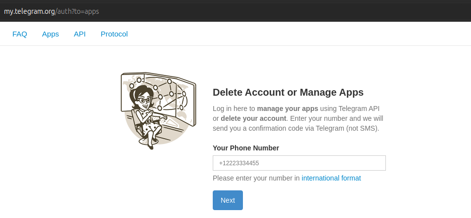
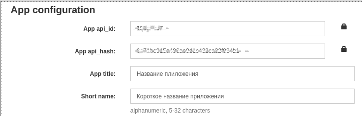

## Настройка переменных окружения относящихся к Telegram

1. идем по ссылки https://my.telegram.org/apps
2. Регистрируем приложение 

    
3. После авторизации откроется

    

   - Берем значение __App api_id__ и кладем в переменную `TG_API_ID`
   - Берем значение __App api_hash__ и кладем в переменную `TG_API_HASH`
4. В Телеграм регистрируем бота https://t.me/BotFather 
5. Оттуда берем токен бота и кладем в `TG_BOT_TOKEN`
6. В `TG_ADMIN_ID` кладем id своего аккаунта в Телеграмме
7. что бы узнать свой ID можно воспользоваться ботом https://t.me/getmyid_bot

### [НАЗАД](../README.md)
